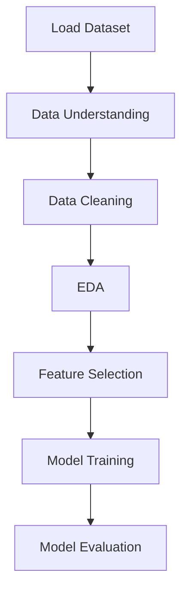

# 📊 Uplift Load Prediction using Machine Learning

## 🚀 Overview

This project focuses on predicting **uplift load** using data analytics and machine learning techniques. The objective is to analyze engineering parameters and build a regression model that can accurately estimate uplift load values.

---

## 🧠 Problem Statement

In geotechnical and structural engineering, predicting uplift load is crucial for designing safe foundations and structures.

This project aims to:

* Analyze the relationship between soil/engineering parameters and uplift load
* Perform exploratory data analysis (EDA) to understand feature behavior
* Build a machine learning model to predict uplift load accurately

---

## 📂 Dataset

* Source: Experimental/Engineering dataset (Excel format)
* Type: Structured numerical dataset
* Target Variable: **Uplift Load**
* Features: Various input parameters influencing uplift behavior

---

## ⚙️ Methodology

### 1. Data Collection

* Dataset loaded from Excel file

### 2. Data Understanding

* Checked dataset shape, data types, and summary statistics
* Identified missing values and feature distributions

### 3. Data Cleaning

* Removed null values
* Ensured consistency in numerical data

### 4. Exploratory Data Analysis (EDA)

* Distribution analysis of uplift load
* Correlation heatmap to identify relationships
* Feature vs target analysis using scatter plots

### 5. Feature Selection

* Selected relevant input variables
* Removed unnecessary or redundant features

### 6. Model Building

* Applied **Linear Regression** model

### 7. Model Evaluation

* R² Score
* Root Mean Squared Error (RMSE)
* Actual vs Predicted comparison

---

## 🔄 Project Workflow



---

## 📊 Key Insights

* Strong correlation observed between certain input features and uplift load
* Linear relationships dominate the dataset, making regression suitable
* Data quality significantly impacts prediction accuracy

---

## 🤖 Model Used

* Linear Regression

---

## 📈 Results

* Model successfully predicts uplift load with reasonable accuracy
* Performance evaluated using:

  * R² Score
  * RMSE

---

## 🛠️ Tech Stack

* Python
* Pandas, NumPy
* Matplotlib, Seaborn
* Scikit-learn

---

## 📁 Project Structure

```
project/
│
├── data/
├── notebook/
├── outputs/
├── README.md
└── requirements.txt
```

---

## ▶️ How to Run

1. Clone the repository

```
git clone https://github.com/your-username/project-name.git
```

2. Install dependencies

```
pip install -r requirements.txt
```

3. Run the notebook

```
jupyter notebook
```

---

## 📌 Future Improvements

* Apply advanced regression models (Random Forest, XGBoost)
* Perform hyperparameter tuning
* Improve feature engineering
* Deploy as a web-based prediction tool

---

## 👤 Author

**Saumojit Roy**
B.Tech IT Student | Data Analytics & Machine Learning Enthusiast
